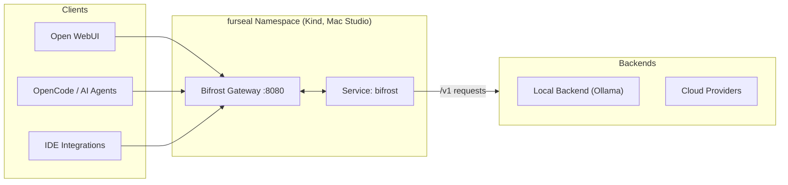

# Bifrost AI Gateway

Bifrost is the **central AI traffic gateway** and OpenAI-compatible proxy for the
`furseal` workspace. It sits at the front of the stack on a Kind Kubernetes cluster (Mac Studio)
and intercepts/transforms LLM API calls from every client — Open WebUI, OpenCode,
programmatic agents, and IDEs — then routes them to one or more backends:

- Local model backend (e.g. **Ollama** running natively on the Mac Studio host)
- Cloud model providers

At a glance: failover + model fallback, unified API-key management, rate limiting, and
asynchronous tracing via Langfuse. Nothing in this repository is application code; it ships only Kubernetes manifests and generated runtime data. See [`AGENTS.md`](./AGENTS.md) for agent/operator constraints (especially the hostPath/data-disk gotcha).

---

## Architecture & Request Flow




## Runtime Data (read me; this bites agents)

Key operational facts pulled directly from `k8s/bifrost-deployment.yaml`:

| Resource               | Value                          | Source in manifest |
|------------------------|--------------------------------|--------------------|
| Container port (name)  | `http` on **8080**             | line 27–29         |
| Service                | ClusterIP, `port: 8080`, `targetPort: 8080` | line 54          |
| Images (current)      | `maximhq/bifrost:latest`       | line 25            |
| Pod/namespace         | namespace `furseal`, 1 replica | lines 3–10, 13    |

---

## Repository Layout

```text
bifrost/
├── .gitignore          # ignores everything under data/*.db* and WAL/SHM sidecars
├── data/               # runtime-generated; see “Runtime Data” below (hostPath-backed)
│   └── logs/           # MUST stay writable for gateway log output
└── k8s/                # single source of Kubernetes truth for this workspace
    └── bifrost-deployment.yaml   Namespace, Deployment, Service, Ingress
```

`k8s/` file map: everything — namespace `furseal`, the `bifrost`
Deployment (image, resources, hostPath volumeMount at `/app/data`), the
Service (port/targetPort **8080**), and an nginx Ingress (`bifrost.localhost`).

---

## Runtime Data (read me; this bites agents)

The container declares a `hostPath` mount that the agent must understand:

```yaml
# from k8s/bifrost-deployment.yaml
volumeMounts: [{name: bifrost-data, mountPath: /app/data}]
volumes:      [{name: bifrost-data, hostPath: {path: "/mnt/workspaces/bifrost/data", type: DirectoryOrCreate}}]
```

Implications for any agent/operator working in this repo:

- The node directory `/mnt/workspaces/bifrost/data` must exist (or be created) before `kubectl apply`. New Kind nodes will **not** have it. Use the exact emptyDir-equivalent or pre-seed that path — there is no `.env`, no init container, and none of this repo’s files populate real content into Git.
- Live state lives on each cluster node, not here: `config.db` (26 MB) and a **~189 MB** `logs.db` live under `./data/`, ignored by `.gitignore`. All persistence is host-local; back it up there or face data loss between redeploy/host-restart.
- Do not edit any `*.db`, `-wal`, `-shm` file with the process running (SQLite locks). Stop the pod (`kubectl scale deployment bifrost --replicas=0 -n furseal`) first, if you must touch these.
- The empty `data/logs/` dir is required and should remain writable; do not delete it on a live host or log ingestion breaks for the gateway container (container runs as its configured user and cannot recreate root-owned dirs on a Mac Studio hostPath).

---

## Prerequisites

1. **Mac Studio**, macOS, with [Docker Desktop](https://docs.docker.com/desktop/install/mac-install/) + a Kind cluster named `kind` (this is what backs the cluster IP that resolves to service bifrost in namespace furseal locally).
2. The namespace `furseal` does not exist yet; this repository creates it for you when first applied via kubectl — no manual pre-creation required, but ensure your Kind kubelet can write `/mnt/workspaces/bifrost/data`. (If Kind storage mapping is non-default on your machine, seed that directory first or change the hostPath accordingly.)
3. A backend service such as **Ollama** is running somewhere reachable from inside `furseal` pods — whether via `--add-host`, a separate Ollama deployment on the cluster network in another namespace under a DNS-resolvable name, an internal LoadBalancer IP for an external box hosting Ollama, or via a `hostPort`. The gateway itself does not expose its backend target endpoint as a service definition here. (No environment variable configuring it yet.)
4. Recommended: nginx Ingress controller installed on Kind (`ingressClassName: nginx`) if you want to reach the ingress object included below; otherwise port-forward 8080 from the deployment is sufficient for testing.

---

## Deployment Guide

Apply everything in one step — this creates `Namespace`, `Deployment`, `Service`, and `Ingress`:

```bash
kubectl apply -f k8s/bifrost-deployment.yaml
```

Wait for rollout (image pull + readiness on an otherwise unsignaled port):

```bash
kubectl rollout status deployment/bifrost -n furseal --timeout=90s
```

If you expect the service to have a reachable DNS hostname inside of `furseal` across namespaces, verify:

```bash
kubectl get svc bifrost -n furseal          # expects ClusterIP with port 8080 -> targetPort 8080 matching lines 54–56 above
```

---

## API Integration & Usage

From anywhere inside the cluster (or via `nginx` ingress on host `bifrost.localhost`), call the OpenAI-compatible surface:

- **Internal K8s base URL:** `http://bifrost.furseal.svc.cluster.local:8080/v1`  
  (the short DNS form is sufficient from any pod in namespace furseal)
- Port always `8080`; ingress host alias `bifrost.localhost`.

Verify reachability; these do not require the backend to succeed, only that Bifrost answers:

```bash
kubectl run -i --rm debug-bifrost \
  --image=curlimages/curl -n furseal --restart=Never -- \
  sh -c 'curl -fsS http://bifrost.furseal.svc.cluster.local:8080/v1/models'
```

Example response shape you should see (`/v1/models`; note the proxy schema follows OpenAI exactly):

```json
{ "object": "list", "data": [ /* backend-specific entries */ ] }
```

For a chat request, POST to `/v1/chat/completions` per your internal model name(s) returned by the previous call; example minimal body:

```bash
curl -fsSL http://bifrost.furseal.svc.cluster.local/v1/chat/completions \
  -H "Content-Type: application/json" \
  -d '{
    "model": "<exact identifier from /v1/models>",
    "messages": [ {"role":"user","content":"What is the capital of Finland?"} ]
  }'
```

(There are currently no environment variables, keys, or per-backend credentials in `bifrost-deployment.yaml`; authentication and backend URL configuration will be added under `containers[].env` (or via a referenced Secret) before exposing any protected route. At the moment `/v1/*` is served directly from the image defaults.)

---

## Monitoring & Troubleshooting

Read what you need to survive an outage:

```bash
kubectl logs -f deployment/bifrost -n furseal          # primary, stream of last-minute requests/errors
kubectl describe deploy bifrost -n furseal              # for pod placement, restart reasons
kubectl describe svc  bifrost       -n furseal          # confirm port mapping (8080 -> 8080) lines up with your caller expectations
kubectl get ingress             -n furseal              # confirms host/path matches /v1 traffic rules, line-by-line to manifest file above.
```

To force a clean reschedule (e.g., after adjusting the `hostPath`):
```bash
kubectl rollout restart deployment/bifrost -n furseal && \
  kubectl rollout status deployment/bifrost -n furseal --timeout=90s
```

Health posture in today’s manifest is sparse — **no** readiness/liveness probes are defined (see the k8s file: under container spec there are only `ports` entry and not probes field which would appear here), so Kubernetes will mark a stuck pod as healthy until you remove it. Add explicit `/health` probes when you cut over to production traffic; nothing in this repo wires them yet.

---

## Operational Gotchas (agent-facing, non-obvious)

- `.db*` files referenced at `data/` on Mac Studio hosts correspond to the container’s `/app/data`, but **no** test or build artifact here contains the real content once deleted — they are regenerated by runtime state and never committed (`git status` after any restart may show them as untracked, which is expected).
- To inspect a user-facing request path end-to-end locally without touching `bifrost.localhost`, port-forward:
  ```bash
  kubectl -n furseal port-forward svc/bifrost 8080:8080 & curl http://localhost:8080/v1/models
  ```
- Changing the container image via Bifrost upstream requires changing `image:` (currently pinned at :latest), plus updating this README and any ingress/port mappings that reference the previous behavior.

See [`AGENTS.md`](./AGENTS.md) for additional agent-specific cautions, including disk-space escalation patterns where data/*.db* growth can preempt node limits faster than pod autoscaling triggers.