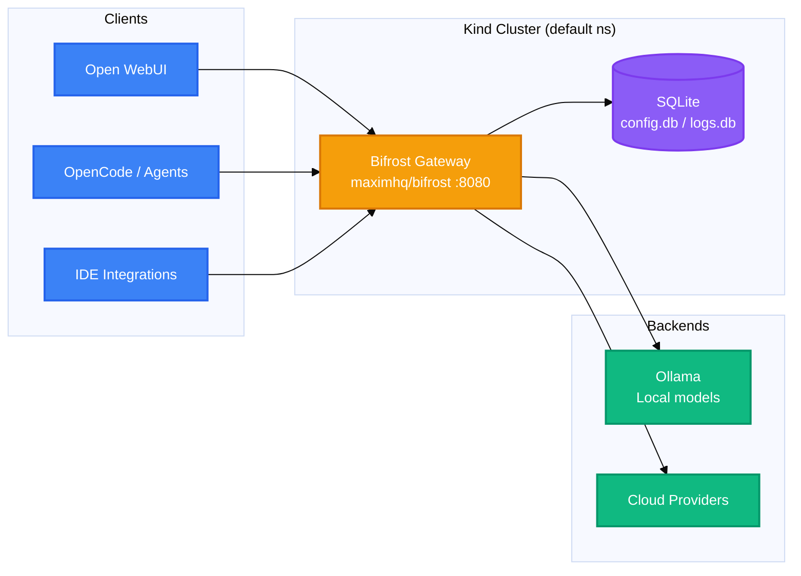

<h1 align="center">Bifrost AI Gateway</h1>
<p align="center">
  <strong>OpenAI-compatible AI gateway that routes LLM traffic from every client to local and cloud model backends on a Kubernetes cluster.</strong>
  <br />
  <em>Central proxy · Model routing &amp; failover · Kind / Kubernetes · SQLite persistence</em>
</p>

<p align="center">
  <a href="#quick-start"></a>
  <a href="LICENSE"></a>
</p>

<p align="center">
  <a href="https://img.shields.io/badge/Kubernetes-326CE5?style=flat&logo=kubernetes&logoColor=white"></a>
  <a href="https://img.shields.io/badge/Docker-2496ED?style=flat&logo=docker&logoColor=white"></a>
  <a href="https://img.shields.io/badge/Nginx-009639?style=flat&logo=nginx&logoColor=white"></a>
  <a href="https://img.shields.io/badge/SQLite-003B57?style=flat&logo=sqlite&logoColor=white"></a>
  <a href="https://img.shields.io/badge/OpenAI--compatible-412991?style=flat&logo=openai&logoColor=white"></a>
</p>

<p align="center">
  <a href="https://img.shields.io/badge/Claude_Code-D97757?style=flat&logo=claude&logoColor=white"></a>
  <a href="https://img.shields.io/badge/GitHub_Copilot-000000?style=flat&logo=github&logoColor=white"></a>
  <a href="https://img.shields.io/badge/Cursor-000000?style=flat&logo=cursor&logoColor=white"></a>
</p>

---

Bifrost is the central AI traffic gateway for this workspace. It sits at the front of the stack on a Kind Kubernetes cluster, intercepts LLM API calls from every client — Open WebUI, OpenCode, programmatic agents, and IDEs — and routes them to one or more backends, including local models (e.g. Ollama on the host) and cloud model providers.

This repository ships no application code. It contains only the Kubernetes manifest that runs the `maximhq/bifrost` gateway image plus generated runtime data. See [`AGENTS.md`](./AGENTS.md) for the agent/operator constraints that apply to this workspace.

## Features

| Feature | Description |
|---|---|
| OpenAI-compatible proxy | Serves the `/v1` surface exactly, so any OpenAI SDK or client works unchanged |
| Central routing | One ingress point for all clients, backed by a single Service/Deployment |
| Failover & model fallback | Requests route to alternate backends when the primary model is unavailable |
| Rate limiting | Per-client limits enforced at the gateway |
| Unified key management | Single place to manage API keys for all downstream backends |
| Async tracing | Request traces exported to Langfuse |

## Quick Start

### Prerequisites

- macOS with Docker Desktop and a Kind cluster named `kind`
- A reachable model backend (e.g. Ollama running on the host, reachable from inside the cluster)
- Optional: nginx Ingress controller installed on the cluster for the `bifrost.localhost` host

### 1. Pre-seed the hostPath directory

The pod mounts `/app/data` from the node path `/mnt/workspaces/bifrost/data`. New Kind nodes will not have this path — create it before applying, otherwise the gateway has nowhere to write config and logs:

```bash
mkdir -p /mnt/workspaces/bifrost/data/logs
```

### 2. Apply the manifest

This creates the Deployment, Service, and Ingress in the current kubectl namespace (default):

```bash
kubectl apply -f k8s/bifrost-deployment.yaml
```

### 3. Wait for rollout

```bash
kubectl rollout status deployment/bifrost --timeout=90s
```

### 4. Verify the gateway answers

No backend is needed for this — it only confirms Bifrost responds:

```bash
kubectl run -i --rm debug-bifrost --image=curlimages/curl --restart=Never -- \
  sh -c 'curl -fsS http://bifrost.default.svc.cluster.local:8080/v1/models'
```

## Usage

Base URL inside the cluster: `http://bifrost.default.svc.cluster.local:8080/v1` (ingress host: `bifrost.localhost`).

### List available models

```bash
curl -fsS http://bifrost.default.svc.cluster.local:8080/v1/models
```

Response shape:

```json
{ "object": "list", "data": [ /* backend-specific entries */ ] }
```

### Chat completion

```bash
curl -fsSL http://bifrost.default.svc.cluster.local:8080/v1/chat/completions \
  -H "Content-Type: application/json" \
  -d '{
    "model": "<exact identifier from /v1/models>",
    "messages": [ {"role": "user", "content": "What is the capital of Finland?"} ]
  }'
```

### Local check without the ingress host

```bash
kubectl port-forward svc/bifrost 8080:8080 & curl -s http://localhost:8080/v1/models
```

## Architecture



## Configuration

Runtime values are defined in `k8s/bifrost-deployment.yaml`, the single source of truth:

| Setting | Value |
|---|---|
| Image | `maximhq/bifrost:latest` |
| Container port | `http` on `8080` |
| Service | ClusterIP, `port: 8080`, `targetPort: 8080` |
| Replicas | 1 |
| Resource requests | `200m` CPU / `512Mi` memory |
| Resource limits | `2` CPU / `2048Mi` memory |
| Data mount | `volumeMounts: /app/data` → `hostPath: /mnt/workspaces/bifrost/data` |
| Ingress host | `bifrost.localhost` (nginx) |

No environment variables or secrets are configured yet. Backend URLs and credentials will be added under `containers[].env` or a referenced Secret (see `k8s/*-secret.yaml`, gitignored) before exposing protected routes.

## API

Endpoints follow the OpenAI API schema:

| Method | Path | Description | Auth |
|---|---|---|---|
| GET | `/v1/models` | List available models | None configured |
| POST | `/v1/chat/completions` | Send a chat completion request | None configured |

## Project Structure

```
bifrost/
├── .gitignore                  # ignores data/, k8s/*-secret.yaml, *.log
├── AGENTS.md                   # agent/operator constraints and gotchas
├── LICENSE                     # MIT license
├── README.md
├── data/                       # runtime SQLite + logs (gitignored, hostPath-backed)
│   └── logs/                   # must stay writable for gateway log output
└── k8s/                        # Kubernetes manifests
    └── bifrost-deployment.yaml # Deployment, Service, Ingress
```

## Tech Stack

### Infrastructure

| Technology | Purpose |
|---|---|
| Kubernetes (Kind) | Cluster runtime; default namespace |
| Docker | Container image `maximhq/bifrost` |
| Nginx Ingress | External host `bifrost.localhost` routing |
| SQLite | Persistent config and logs on the node hostPath |
| Ollama | Local model backend on the Mac Studio host |
| Langfuse | Async request tracing |

## Deployment

Apply or update all resources in one step:

```bash
kubectl apply -f k8s/bifrost-deployment.yaml
```

Verify the Service mapping:

```bash
kubectl get svc bifrost          # ClusterIP, port 8080 -> targetPort 8080
```

Restart the pod after hostPath changes:

```bash
kubectl rollout restart deployment/bifrost && \
  kubectl rollout status deployment/bifrost --timeout=90s
```

Operational notes:

- SQLite files in `data/` are locked by the running pod. Stop the pod first (`kubectl scale deployment bifrost --replicas=0`) before inspecting them.
- `logs.db` grows unbounded on the host disk. Prune it from `/mnt/workspaces/bifrost/data` when node free space is low, then restart the pod.
- No readiness/liveness probes are defined; add explicit probes before production traffic.

## Contributing

1. Fork the repository
2. Create a feature branch (`git checkout -b feature/my-change`)
3. Commit your changes (`git commit -m 'feat: add feature'`)
4. Push to the branch (`git push origin feature/my-change`)
5. Open a Pull Request

## License

[MIT](LICENSE)
